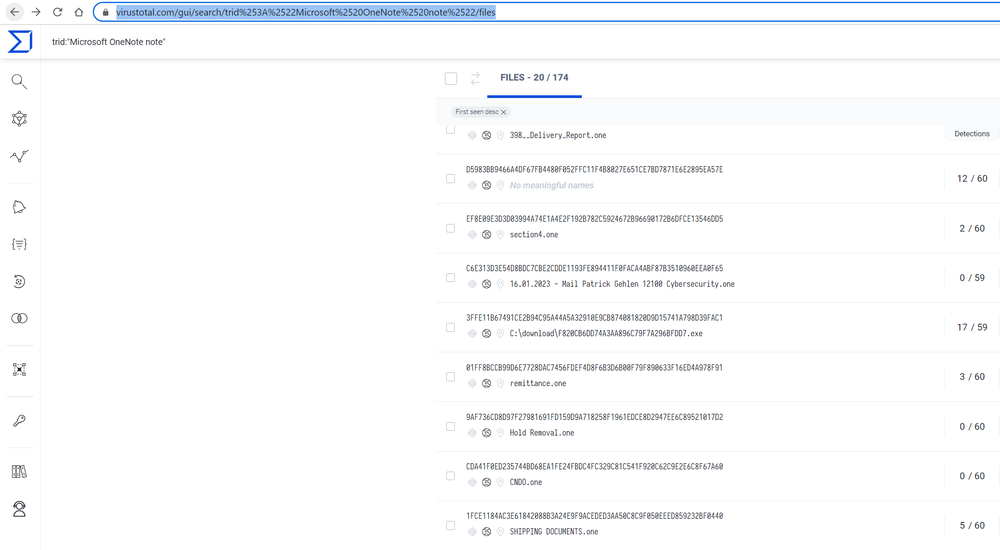

# OneNote-Malware-Analysis
This is just a random tool to aid you in analysing OneNote malware or phishing OneNote documents.

**Disclaimer**: I have not completed coding this tool as I'm kind of busy. It won't detect those OneNote files with Phishing URLs.

Ever since i read [this article](https://blog.sevagas.com/?RedTeam-With-OneNote), i've made a tool for it but I didn't get time to make this public.

Basically I am just using the dll from [Aspose](https://releases.aspose.com/note/net/)

You can download the dll here.

Remember to `Add Reference`, pointing to the dll to your project.

If you check out the [API here](https://reference.aspose.com/note/net/)

There are lots more that you can add to this project as part of your malware analysis process.

So based on the more [recent article of OneNote used in spreading Malware by Spider Labs](https://www.trustwave.com/en-us/resources/blogs/spiderlabs-blog/trojanized-onenote-document-leads-to-formbook-malware/)

If you have access to VirusTotal, we can use `trid:"Microsoft OneNote note"` as shown here to quickly find all the OneNote Samples on VirusTotal.

If not, we can slowly build Yara rules or tools to identify all the `Microsoft OneNote` files.

The header starts with `E4525C7B8CD8A74DAEB15378D029` in hex

Using this impromptu tool here, we can gather more information as shown here

If we look at the attachment, we can see that it is actually downloading the decoy OneOne file from `hxxps://www[.]onenotegem[.]com/uploads/soft/one-templates/four-quadrant.one` and the actual malicious script from `hxxps://transfer[.]sh/get/eSG4hQ/fresh.bat`

Since the file from `transfer[.]sh` is now invalid. I can't show anything now.

